# Login project design
| Components | Tech Stack | Description | K8s Resource Objects |
| :--- | :--- | :--- | :--- |
| Frontend | Typescript + Vue (Nginx) | Take input from public users | Deployment + Service (ClusterIP) |
| Backend |	Python (FastAPI/Flask) | dealing with business logic, such as connecting database, data validation | Deployment HorizontalPodAutoscaler | 
| Database | PostgreSQL | Storing data information | StatefulSet + PersistentVolumeClaim |
| Exposure Service | Ingress | | Ingress Controller (NGINX/Traefix) |
</br>

# Project Core Steps Breakdown 
<details>
<summary>1. Environment Setup</summary>

- Provision a Virtual Machine (VM) - UTM
- Install Operating System (OS) - Ubuntu 24.04
- Configure Network & SSH
- Disable Swap (`Prerequisites for running Kubernetes`)
</details>

<details><summary>2. Runtime Installation</summary>

- Install Container Runtime - containerd
- Configure Systemd Cgroup Driver - Allow Kubernetes to manage resources more effectively
- Restart & Verify Service
</details>

<details><summary>3. K8S Components Installation</summary>

- Add Kubernetnes Repository
- Install Kubeadm, Kubelet, and Kubectl
- Hold packages - Prevent automatic updates from causing cluster incompatibility 
- - kubelet(The "Site Manager")
>
> - role: The Node Agent
>
> - Key Action: This is the most important component running on every server (node) in the cluster. It acts like a manager on a construction site. Its job is to make sure that the containers (Pods) are running as they should be.
- kubeadm (The "Architect")
> - role: The Cluster Bootstrapper
>
> - Key Action: You use it once to set up the cluster (kubeadm init) or to add new servers to the cluster (kubeadm join).
- kubectl (The "Command Center")
>
> - role: The Command Line Interface (CLI).

| Tool | Analog |	Frequency of Use	| Where it runs |
| :--- | :--- | :--- | :--- |
| kubeadm	| The Constructor	| Only for setup/updates |	On the servers |
| kubelet	| The Foreman	| Always running (24/7)	| On every server |
| kubectl	| The Remote Control	| Every time you work	| On your Mac |
</details>

<details><summary>4. Cluster Initialization</summary>

1. Initialize Control Plane - operate `kubeadm init`
2. Set up Kubeconfig
3. Deploy Pod Network Add-on (CNI) - Allow communications between pods.
</details>

<details><summary>5. Verfication & Deployment</summary>

- Check Node Status `kubectl get nodes`
- Deploy Login Application
- Expose Service - Allow access the service from the public
</details>

---

# Kubernetes cluster Creation Core Steps Breakdown
### 1. Create Master Node with name `k8s-master`
<details><summary>📝 Steps</summary>

1. Choose `Create a New Virtual Machine`, then `Virtualize` for best performance
2. Choose Ubuntu Server ARM64 iso file
3. Setup hardware:

- RAM: save at least 2048 MB (2GB). 

 **NOTE:** A minimum of 2GB of RAM is required; otherwise, the K8s control plane will not start.

- CPU: 2

- Storage: 20GB or more (K8s images are quite large)

Share context: skip for now

Tick Install OpenSSH server, then you can access the master node via Mac Terminal.

`IPv4 address for enp0s1: 192.168.64.2` is somewhere telling you the IP address like family address.
</details>

<details><summary>💡 Knowledge: LVM and htop</summary>

### 1. Why use LVM?
LVM (Logical Volume Management) acts like a "flexible rack" for the hard drive. 

- LVM allows you to resize partitions easily without reinstalling the OS
- Ideal for Kubernetes image storage
---
### 2. Install htop
```bash
# Manage your Linux infrastructure
sudo apt install htop
```
- `apt` (Advanced package Tool): This is the Package Manager for Ubuntu. View it Like `App Store` for Linux command lines.
- `htop` software name. It is an interactive process viewer and system monitor
---
### 3. turn off Swap 
```bash
sudo sed -i '/swap/d' /etc/fstab
```
🤔💭 Why?

Kubernetes requires full control of memory:

- Swap hides real memory usage
- Scheduler decisions become inaccurate

**TIP:** Why do we go through the trouble of modifying /etc/fstab?
Because Kubernetes is designed around the principle of “full control.” If the system allows swap (virtual memory), then when memory runs low, Linux may silently move data to disk. This makes it difficult for Kubernetes to accurately measure and manage Pod performance.
</details>

<details><summary>Verify</summary>

1. Start Master Server, input username and password, then check IP address `ip addr show enp0s1`
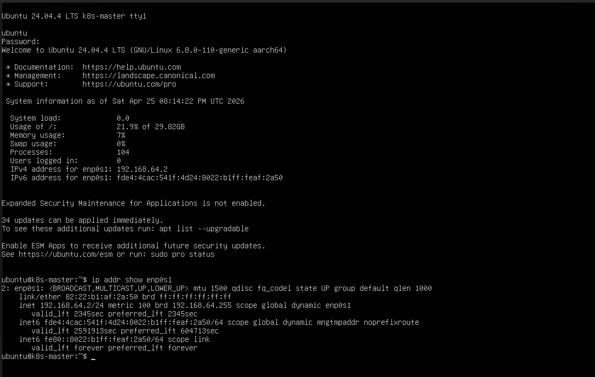

2. SSH Connect from Mac terminal `ssh ubuntu@192.168.64.2`
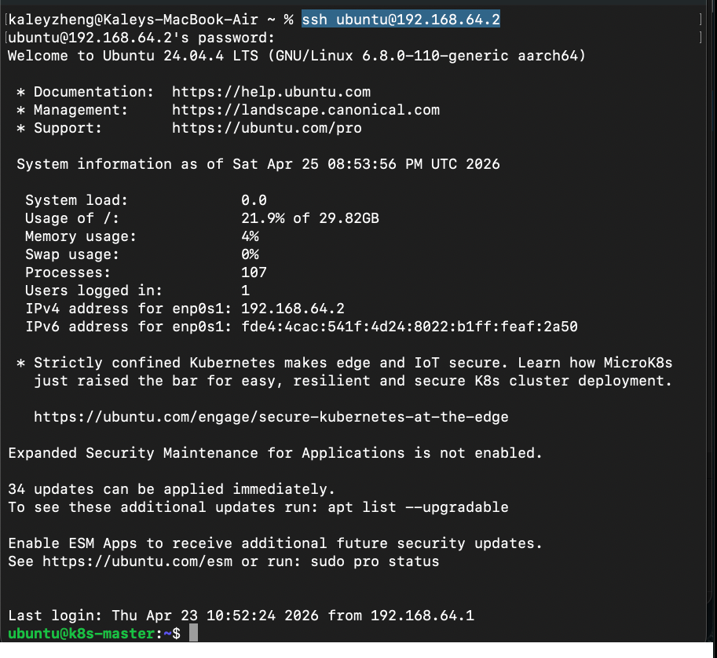

3. Check environment to ensure Swap is closed `free -h`
```bash
# all values in line Swap should be 0
sudo swapoff -a
```
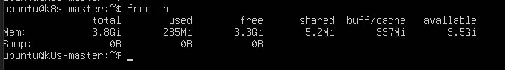
</details>

### 2. Install Container Runtime and K8S Components in `k8s-master` server
<details><summary>📝 Steps</summary>

1. Forward IPv4 and allow iptables to see bridged traffic. This is a mandatory prerequisite for Kubernetens networking.

2. Run following commands either via k8s-master server or via Mac terminal (need to ssh k8s-master server first)
```bash
cat <<EOF | sudo tee /etc/modules-load.d/k8s.conf
overlay
br_netfilter
EOF

sudo modprobe overlay
sudo modprobe br_netfilter

# Configure the required sysctl parameters and ensure they persist across reboots.
cat <<EOF | sudo tee /etc/sysctl.d/k8s.conf
net.bridge.bridge-nf-call-iptables  = 1
net.bridge.bridge-nf-call-ip6tables = 1
net.ipv4.ip_forward                 = 1
EOF

# Apply sysctl parameters without a reboot.
sudo sysctl --system
```

📌 **Reference** see `Explantion 1`

2. Install containerd
```bash
sudo apt update
sudo apt install -y containerd
```

3. Generate the default configuration file (Critical Step)
```bash
# K8s requires a specific configuration for containerd, so to generate a default fire fist.
sudo mkdir -p /etc/containerd
containerd config default | sudo tee /etc/containerd/config.toml
# Modify the configuration file to use SystemdCgroup (for better performance and stability)
# Set SystemdCgroup to true in the configuration file to ensure stable resource management
sudo sed -i 's/SystemdCgroup = false/SystemdCgroup = true/g' /etc/containerd/config.toml
sudo systemctl restart containerd
```

4. Verify containerd status
```bash
# Reboot and verify
sudo systemctl restart containerd
sudo systemctl status containerd
```
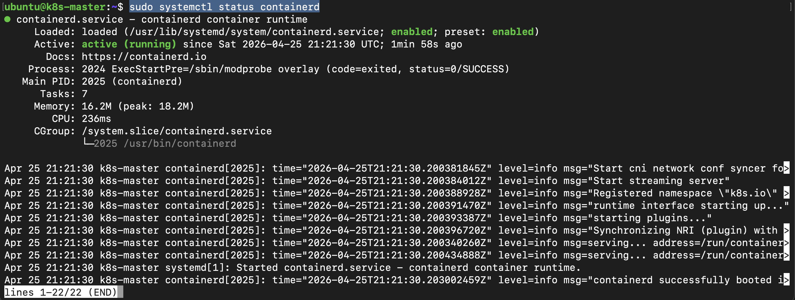

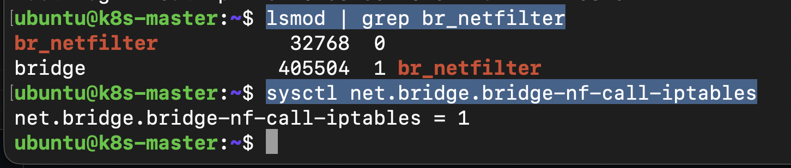

5. Install kubeadm, kubelet, kubectl
```bash
# 1. Update apt and install basic dependencies
sudo apt-get update
sudo apt-get install -y apt-transport-https ca-certificates curl

# 2. Download k8s signing key
curl -fsSL https://pkgs.k8s.io/core:/stable:/v1.30/deb/Release.key | sudo gpg --dearmor -o /etc/apt/keyrings/kubernetes-apt-keyring.gpg
# Verify
gpg --show-keys /etc/apt/keyrings/kubernetes-apt-keyring.gpg
# or better way
gpg --with-fingerprint --show-keys /etc/apt/keyrings/kubernetes-apt-keyring.gpg

# 3. Create a mandatory binding to achieve three critical security goals:
# Goal 1: Scope Isolation: Only this specific Kubernetes repository is allowed to be verified by this specific key.
# Goal 2: Principle of Least Privilege, grant it the authority to trust only Kubernetes-related packages.
# Goal 3: Simplified Auditing and Maintenance: When you eventually need to perform Key Rotation (updating expired keys) or remove a repository, you know exactly which file corresponds to which service. 
echo 'deb [signed-by=/etc/apt/keyrings/kubernetes-apt-keyring.gpg] https://pkgs.k8s.io/core:/stable:/v1.30/deb/ /' | sudo tee /etc/apt/sources.list.d/kubernetes.list

# 4. Installation
sudo apt-get update
sudo apt-get install -y kubelet kubeadm kubectl

# 5. Pin the version, to prevent accidental upgrades that could break the cluster
sudo apt-mark hold kubelet kubeadm kubectl
```

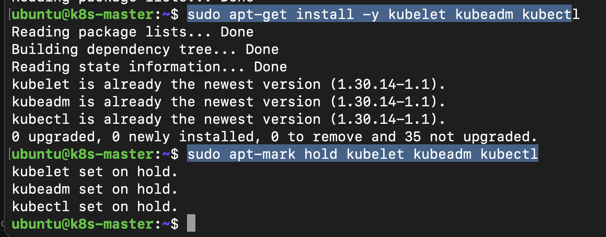

</details>
<details><summary>💡 Knowledge: Supply Chain Security in Kubernetes Installation</summary>

### 1. Why download k8s signing key?
### 🔐 What is this step?

Downloading the signing key is a **core practice of Software Supply Chain Security**.

It ensures that tools like `kubeadm`, `kubelet`, and `kubectl`:
- come from the **official Kubernetes source**
- have **not been tampered with**
- are **safe to install**

---

### 🛡️ Why it matters
#### 1. Prevent Man-in-the-Middle (MITM) attacks

When installing packages via `apt`:
- Data travels through multiple network nodes
- Attackers could intercept and replace packages

**How signing protects you:**
- Maintainers sign packages using a **private key**
- Your system verifies using the **public key**
- If verification fails → installation is blocked

---

### 2. Establishing a Chain of Trust

By default, Linux package managers (e.g. `apt`) **do not trust third-party repositories**.

When you add a new repository (such as Kubernetes), the system has:
- no prior trust relationship
- no way to verify package authenticity

---

#### ⚠️ What happens without a signing key?

During `apt update`, the signatures couldn't be verified.
</details>

### 3. Create and Join k8s worker nodes
<details><summary>📝 Steps</summary>

#### 1. Base Environment Setup (Execute on all Nodes)

- **Environment Prerequisites** (Ensure kubeadm join successfully)
  - **Unique Hostname**：Unique hostnames across the cluster. (e.g., k8s-worker-1, k8s-worker-2).
  - **Unique MAC/Product_UUID**：Unique MAC addresses and product_uuid for each VM. (Select the "Generate new MAC address" option for VMs cloning). 
  - **Disable Swap**: Swap must be permanently disabled.`sudo swapoff -a`
  - **Install CRI (containerd)**
  - **Install K8s Binaries**: Install kubeadm, kubelet, and kubectl. Their versions must be consistent with the Control Plane (Master Node).

  👉 Step 1: Create 3 worker nodes in UTM
k8s-worker-1 on UTM by cloning the Master Node:
    > - Ensure k8s-master server is down
    > - Right click `k8s-master` and choose `Clone`
    > - 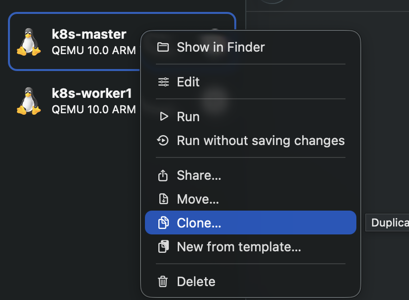
    > - Rename the new server as `k8s-worker-1`, `k8s-worker-2`, and `k8s-worker-3`
    > - 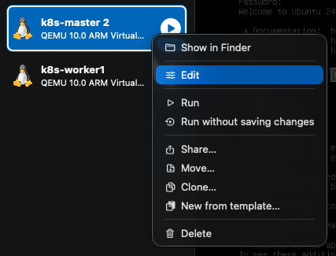
    > - 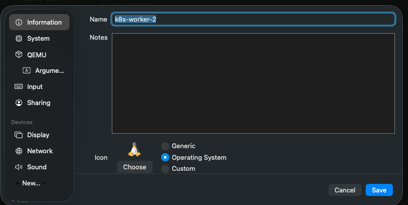
    > - **Note**: This avoids redundant installation of Docker, kubeamd, and dependencies, maximizing efficiency.

   👉 Step 2: Reset Network Identity (Critical Step):
    > - Go to the Settings -> Network menu for k8s-worker1
    > - Click the `Refresh/Random` button next to the MAC Address field to generate a new MAC address
    > - 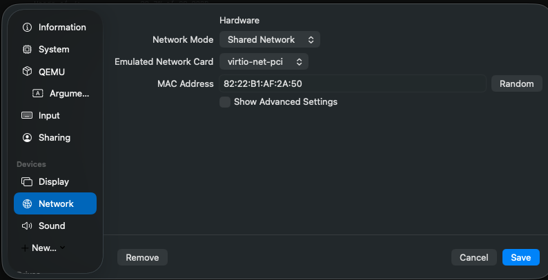
    > - **Note**: Skipping this step will cause a network conflict between the Master and Worker nodes due to identical MAC addresses.
    > - Start k8s-worker1 and log in
    > - 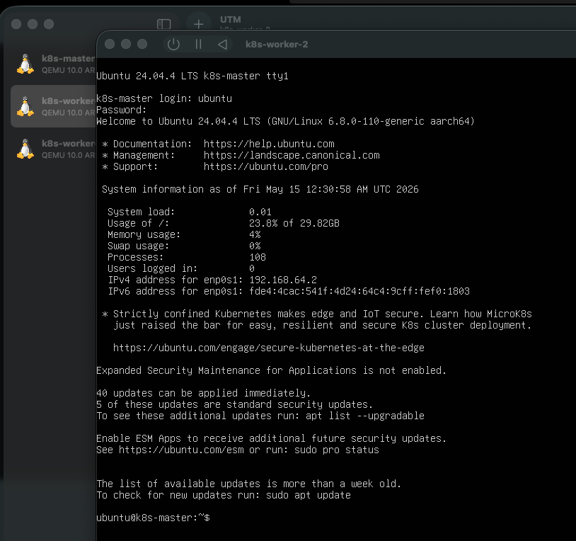

  👉 Step 3: Cleanup and Renaming (De-identifciation)
    > - Since this node was cloned from the Master, it carries the Master's "DNA." We must clean it thoroughly to remove its original identity
    > - 1️⃣: rename host name: `sudo hostnamectl set-hostname k8s-worker-1`
    > - 2️⃣: reset Kubernetest state :
    >>>  - clean up all legacy cluster configurations and certificates: `sudo kubeadm reset -f`
    >>>  - delete old local configurations: `rm -rf ~/.kube`, then `sudo rm -rf /etc/kubernetes/`
    > - 3️⃣: confirm IP address `ip addr show enp0s1`
    > - 4️⃣: reboot and login to `k8s-worker-1`: `sudo reboot` or `exec bash`(logoff and login, do not reboot the server)
    > - 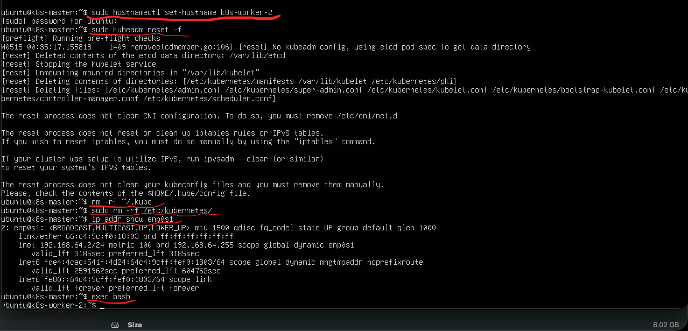

  ⚠️ **A Crucial Check** (Specifically for DevOps Best Practices) - Since this node was cloned from the Master, your /etc/hosts file likely still contains outdated information or self-referential entries that point to the wrong IP
  > - `cat /etc/hosts`, rename `k8s-master` to `k8s-worker-1` in line `127.0.1.1` by command `sudo nano /etc/hosts`, then `exec bash`
  > - 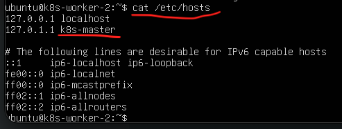
  > - 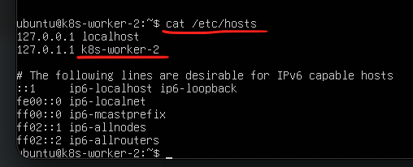
  > - verify if it sesolves to `127.0.1.1`: `ping k8s-worker-1 -c 2`
  > - confirm the IP has not changed: `ip addr show enp0s1`
  > - 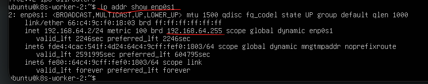
  > 
Verify:
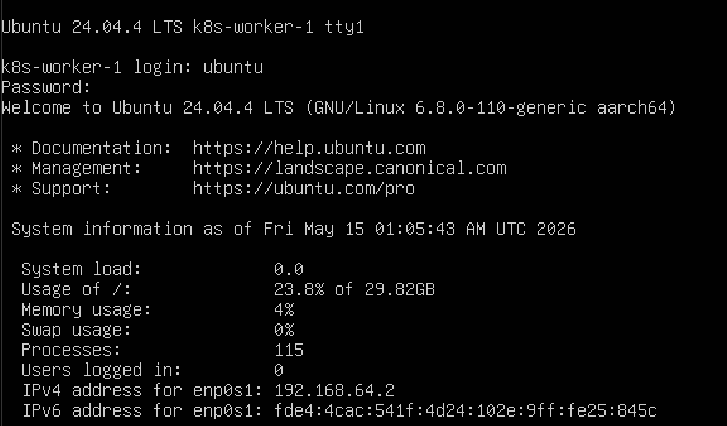
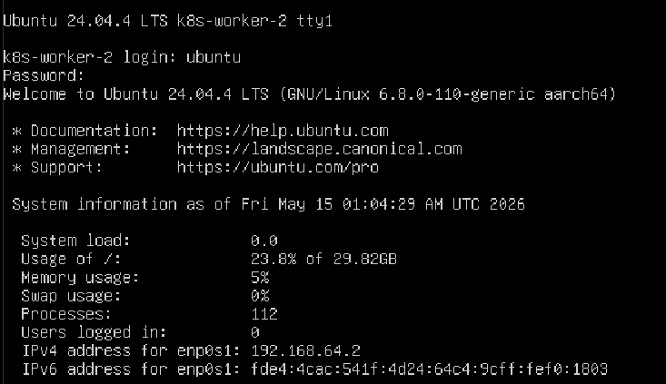
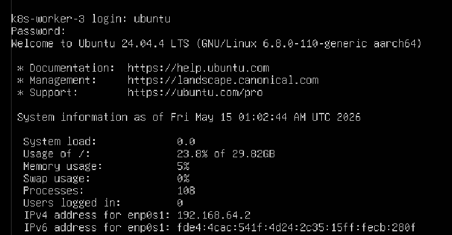

🚫 Within the same Kubernetes cluster, every node must have a unique IP address: 
> If all three Worker Nodes share the exact same IP address, they will clash at the network layer. This will cause the `kubeadm join` command to fail, or even if they manage to join, Pod communication will completely collapse.
>
> **Why do they have the same IP?**
>> Since these nodes were created via Cloning, they are essentially "carbon copies" of the Master. Even if you clicked "Random" in the UTM interface to generate a new MAC address, conflicts often persist because:
>> - The VMs might have a Static IP pre-configured in their settings.
>> - They share the same Machine ID, which can cause a DHCP server to assign the same IP address to different machines.
>
> **How to fix?**
>> Perform the following steps in order, on every Worker Node:
>> 1. Refresh DHCP Lease: Force the network service to request a fresh, unique IP address from the gateway.
>> - release current IP: `sudo dhclient -r`
>> - obtain a new IP:`sudo dhclient`
>> 2. Check Machine ID (Deep Fix)
>> - Cloned Linux systems often receive the same IP address from DHCP because they share the same /`cat etc/machine-id`
>> 3. 🔄 Do following steps if ID is identical
>> - `sudo rm /etc/machine-id`
>> - `sudo dbus-uuidgen --ensure=/etc/machine-id`
>> - `sudo reboot`

> - 🔎 ifconfig and dhclient are often deprecated or not installed in Ubuntu by default. Can use `sudo netplan apply`. If it does not work. Will apply following steps to fix machine ID
>> 1. Clear the machine-id file
>>> - `sudo truncate -s 0 /etc/machine-id`
>>> - `sudo rm /var/lib/dbus/machine-id`
>>> - `sudo ln -s /etc/machine-id /var/lib/dbus/machine-id`
>> 2. Generate a new unique ID
>>> - `sudo dbus-uuidgen --ensure=/etc/machine-id` 
>> 3. Reboot the VM to trigger a new DHCP request
>>> - `sudo reboot`
`
>> 4. 🛡️ Verification in single Worker Node
>> - `ip addr show` or `ip addr show enp0s1`
>
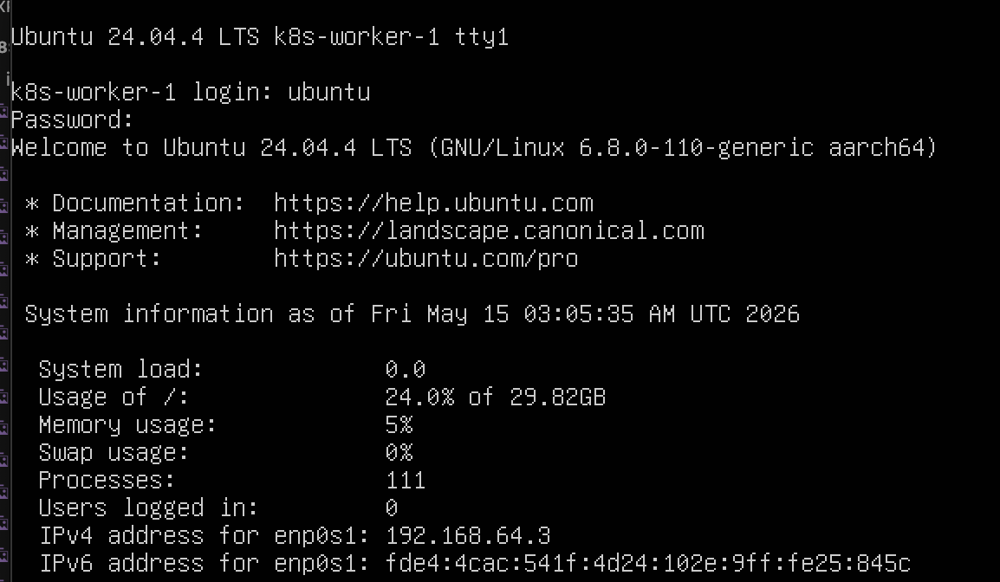
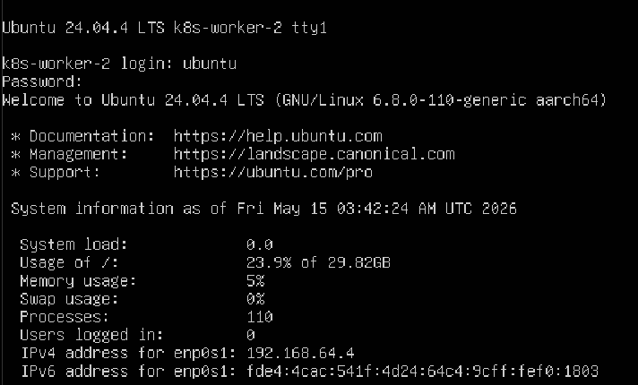
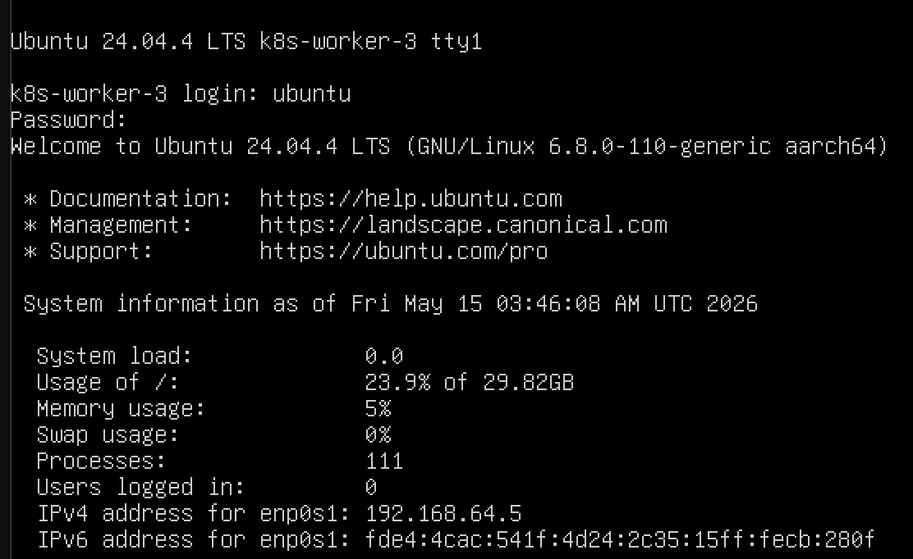

第二步：获取 Master 的 Join Token
回到你的 k8s-master 节点，运行以下命令获取加入集群的指令：
kubeadm token create --print-join-command

输出内容大概长这样（记住这个输出，一会儿在 Worker 上跑）：
kubeadm join 192.168.x.x:6443 --token <token> --discovery-token-ca-cert-hash sha256:<hash>
提示：如果 Token 过期了（默认 24 小时），随时可以用这个命令重新生成。
第三步：在 Worker Node 上执行 Join
分别登录到你的三个 Worker Node，直接运行上面拿到的 kubeadm join 命令。
运行成功后，你会看到类似 This node has joined the cluster 的提示。
第四步：在 Master 上验证
回到 k8s-master，查看节点状态：
kubectl get nodes

可能遇到的状态：
•	Ready: 完美，一切正常。
•	NotReady: 通常是因为 CNI (Network Plugin) 还没装或者还没初始化好。由于你要练习 Istio，建议先安装一个基础 CNI（如 Cilium 或 Calico），因为 Istio 依赖 Pod 之间的网络通畅。
第五步：针对你项目的进阶建议
作为未来的 AI Infra/Security 工程师，在创建 Worker Node 时建议考虑以下细节：
	1.	资源预留 (Isolation)：
在 UTM 中给 Worker 分配资源时，考虑到你要跑 PostgreSQL (StatefulSet) 和 Istio (Sidecars)，每个 Worker 建议至少 2 vCPU / 4GB RAM。Istio 的 Sidecar 会额外消耗内存。
	2.	Label 节点 (Tainting & Labeling)：
AI 任务通常需要调度到特定节点。你可以练习给其中一个 Worker 打上标签：

这能帮你练习之后的 nodeSelector 或 Affinity 配置。
	3.	安全加固 (CIS Benchmark)：
在加入节点后，可以尝试运行 kube-bench 扫描一下 Worker 的安全配置。这是 Security 岗位面试时可以聊的“实战细节”。
</details>

# Develop and Deploy App Core Steps Breakdown
<details><summary>1. Prepare Docker images</summary>

- ⚛️ Frontend Dockerfile - use Nginx to serve static JS and HTML files
- 🛠️ Backend Dockerfile - install python, run API server
- 🛢 No Dockerfile, config image:postgres in k8s 
</details>

<details><summary>2. Create Kubernetes deployment yaml files (or helm chart - in dockerfile)</summary>

1. deployment.yaml - create pod
2. service.yaml - allow communication internally and externally
</details>

<details><summary>3. Deploy the app to local Cluster</summary>

> **Note:** Config PersistentVolume(PV) and PersistentVolumeClaim(PVC) for database persistence

> **Tips:** 
> 1. Avoid hardcoding IP addresses when connecting to the database. Using Service name (e.g., http://db-service:3306) for database directly access. 预留问题1: 以后使用https
>
> 2. Avoid writing secrets in yaml file, using K8s secret component.

</details>

<details><summary>4. Verify App</summary>

- Confirm containers status are all running using `kubectl get pods`
- Expose the frontend using `kubectl port-forward` or `NodePort service` to access the UL.
- Input account password, or create/update/delete new account, monitor endpoint logs `kubectl logs <backend-pod-names>`
</details>

<details><summary>k8s deployment yaml example</summary>

- db.yaml
```
apiVersion: apps/v1
kind: Deployment
metadata:
  name: mysql-db
spec:
  selector:
    matchLabels:
      app: mysql
  template:
    metadata:
      labels:
        app: mysql
    spec:
      containers:
      - name: mysql
        image: mysql:8.0
        env:
        - name: MYSQL_ROOT_PASSWORD
          value: "password123"
        - name: MYSQL_DATABASE
          value: "userdb"
---
apiVersion: v1
kind: Service
metadata:
  name: db-service
spec:
  selector:
    app: mysql
  ports:
    - protocol: TCP
      port: 3306
```
- backend.yaml
```
apiVersion: apps/v1
kind: Deployment
metadata:
  name: backend-deploy
spec:
  replicas: 1
  selector:
    matchLabels:
      app: backend
  template:
    metadata:
      labels:
        app: backend
    spec:
      containers:
      - name: backend-container
        image: login-backend:v1
        imagePullPolicy: Never # 强制 K8s 使用本地镜像
        env:
        - name: DB_HOST
          value: "db-service" # 关键：利用 K8s 服务发现连接数据库
---
apiVersion: v1
kind: Service
metadata:
  name: backend-service
spec:
  selector:
    app: backend
  ports:
    - port: 3000
      targetPort: 3000
```
- port forward
```
# 将集群内后端的 3000 端口转发到你 Mac 的 3000 端口
kubectl port-forward service/backend-service 3000:3000
```
</details>

<details><summary>☝️🤓 TIP</summary>
1. `sudo poweroff` to turn off k8s-master node
预留问题1: 以后使用https
</details>

<details><summary>Explanation  1</summary>
以上设置是Kubernetes网络配置中非常低层。目的是确保容器之间的网络流量能够被Linux内核正确地拦截、转发和处理。以上代码是在Master Node上操作。

1. 开启内核模式（设置桥接流量）
Kubernetes 的 Pod 网络插件（如 Calico 或 Flannel）通常依赖 overlay 和 br_netfilter 这两个内核模块。
•	overlay: 允许容器文件系统的分层叠加。
•	br_netfilter: 使得经过 Linux 网桥的流量能够被 iptables 处理。
```bash
# 创建一个配置文件，让系统在重启后自动加载这些模块
cat <<EOF | sudo tee /etc/modules-load.d/k8s.conf
overlay
br_netfilter
EOF

# 立即手动加载模块
sudo modprobe overlay
sudo modprobe br_netfilter
```
2. 配置 sysctl 参数 (允许 iptables 检查流量)。加载了模块后，你还需要显式地告诉 Linux 内核，把网桥上的流量交给 iptables 规则去过滤。这是实现 K8s Service（负载均衡）和 Network Policy（安全策略）的基础。
```bash
# 创建 sysctl 配置文件
cat <<EOF | sudo tee /etc/sysctl.d/k8s.conf
net.bridge.bridge-nf-call-iptables  = 1
net.bridge.bridge-nf-call-ip6tables = 1
net.ipv4.ip_forward                 = 1
EOF

# 应用参数，无需重启
sudo sysctl --system
```
3. 为什么要这样做？（原理拆解）
在默认情况下，Linux 的网桥（Bridge）工作在数据链路层（L2），而 iptables 工作在网络层（L3）。
•	如果没有 br_netfilter: 容器之间的二层流量会直接通过网桥转发，绕过 iptables。
•	后果: K8s 无法通过 iptables 规则来实现 Service 的转发，也无法通过 Network Policy 来阻断不合规的流量。
4. 验证配置是否生效
配置完成后，你可以运行以下命令检查：
	1.	检查模块: lsmod | grep br_netfilter （如果有输出则正常）。
	2.	检查内核参数: sysctl net.bridge.bridge-nf-call-iptables （输出应为 1）。
</details>

Master: ubuntu (12345)
Worker_1: 
Worker_2: 
Worker_3: 
